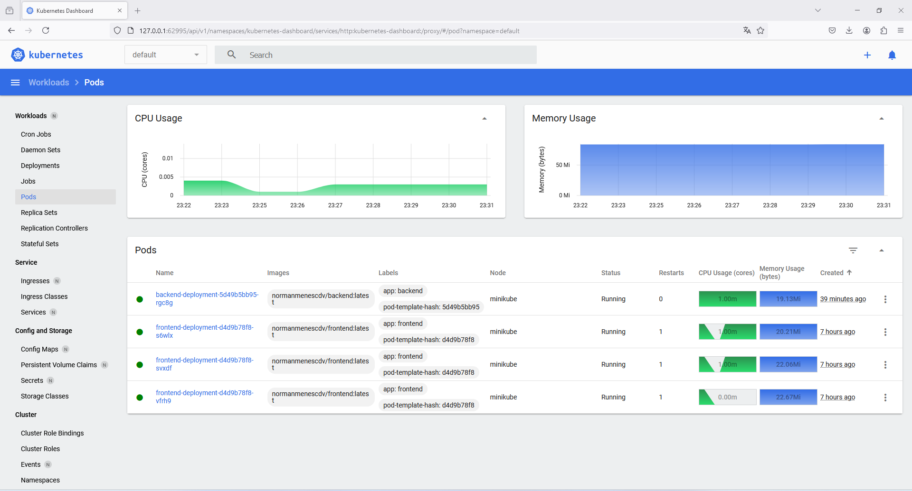
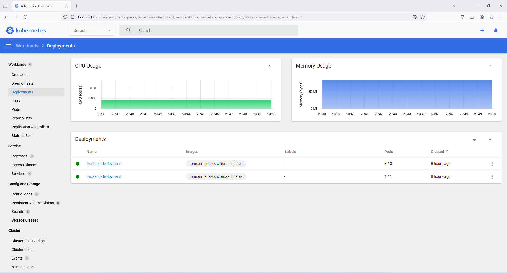
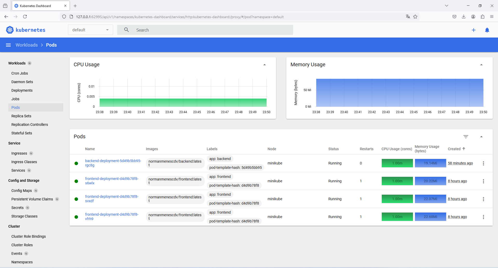
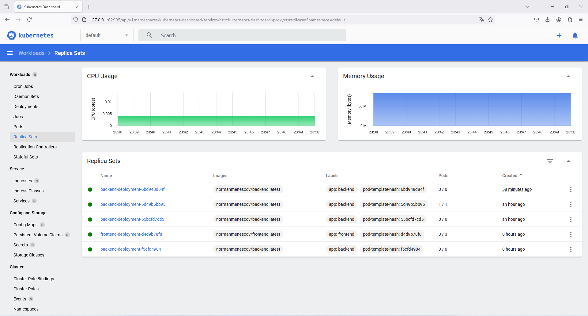
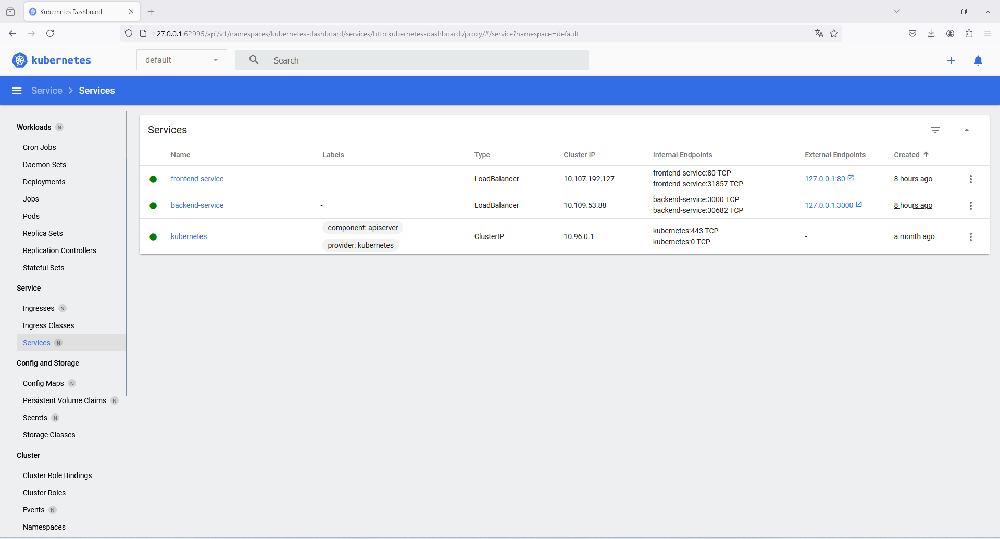
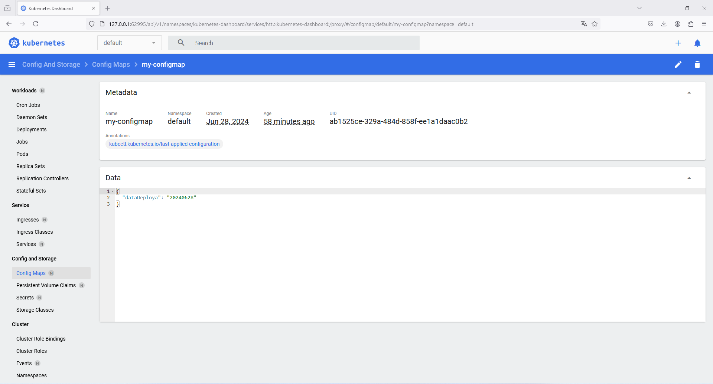

# Projekt Kubernetes

> Kod aplikacji pochodzi z oficjalnego [repozytorium Dockera](https://github.com/docker/getting-started-app), natomiast podzielono ją na dwie aplikacje - frontend i backend - i wprowadzono w niej kilka nieznacznych zmian

Obrazy Dockerowe zbudowane w ramach niniejszego projektu i wrzucone do Docker Hub znajdują się na [moim profilu](https://hub.docker.com/u/normanmenescdv/).

## Wdrożenie aplikacji kubernetes

1. Budowanie obrazów dockerowych

   ```
   docker build -t backend ./backend
   docker build -t frontend ./frontend
   ```

2. Zaloguj się do Docker Hub

   ```
   docker login
   ```

3. Utwórz tag dla repozytorium i wyślij obraz do Docker Hub

   ```
   docker image tag backend:latest normanmenescdv/backend:latest
   docker image tag frontend:latest normanmenescdv/frontend:latest

   docker push normanmenescdv/backend:latest
   docker push normanmenescdv/frontend:latest
   ```

4. Wdrożenie aplikacji w Kubernetes

   ```
   kubectl apply -f ./k8s/backend-deployment.yaml
   kubectl apply -f ./k8s/backend-service.yaml
   kubectl apply -f ./k8s/frontend-deployment.yaml
   kubectl apply -f ./k8s/frontend-service.yaml
   ```

5. Sprawdź uruchomione usługi

   ```
   kubectl get pods           # wyświetl uruchomione pody
   kubectl get deployments    # wyświetl działające deploymenty
   kubectl get services       # wyświetl działające usługi
   ```

6. Uruchom minikube

   ```
   minikube start
   minikube dashboard
   ```

7. Wyświetl dane poda

   ```
   kubectl describe pod <nazwa_poda>   # wyświetl informacje o podzie
   kubectl logs <nazwa_poda>           # wyświetl logi poda
   ```

## Rolling Update: Aktualizacja aplikacji bez przestojów

Monitorowanie stanu wdrażania (postępu aktualizacji)

```
kubectl rollout status deployment/backend-deployment
kubectl rollout status deployment/frontend-deployment
```

## Rollback

Przywracanie do poprzedniej wersji deploymentu:

```
kubectl rollout undo deployment/backend-deployment
kubectl rollout undo deployment/frontend-deployment
```

Monitorowanie stanu wdrażania (postępu przywracania)

```
kubectl rollout status deployment/backend-deployment
kubectl rollout status deployment/frontend-deployment
```

## Skalowanie w zależności od obiążenia

1. Zainstalowanie `metrics-server`

   a. Oryginalna instalacja

   ```
   kubectl apply -f https://github.com/kubernetes-sigs/metrics-server/releases/latest/download/components.yaml
   ```

   b. Dedykowana instalacja (z wyłączoną weryfikacją certyfikatu TLS)

   ```
   kubectl apply -f .\k8s\metrics-server.yaml
   ```

2. Wdrożenie HPA

   ```
   kubectl apply -f ./k8s/hpa.yaml
   ```

3. Sprawdzenie działania metryków zasobów:

   a. przy pomocy `kubectl`

   ```
   kubectl top nodes
   kubectl top pods --all-namespaces
   ```

   b. przy pomocy dashboardu

   

## Zarządzanie konfiguracją i sekretami

1. Zastosuj plik `ConfigMap` oraz `Secret`

   ```
   kubectl apply -f .\k8s\configmap.yaml
   kubectl apply -f .\k8s\secrets.yaml
   ```

2. Wyświetl dane konfiguracyjne

   ```
   kubectl describe configmaps my-configmap
   kubectl describe secrets my-secrets
   ```

## Screenshots

1. Deployments

   

2. Pods

   

3. Replica Sets

   

4. Services

   

5. Config

   

6. Secrets

   
